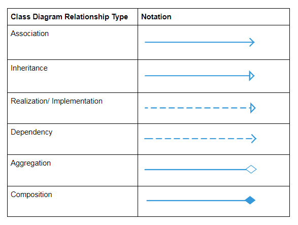
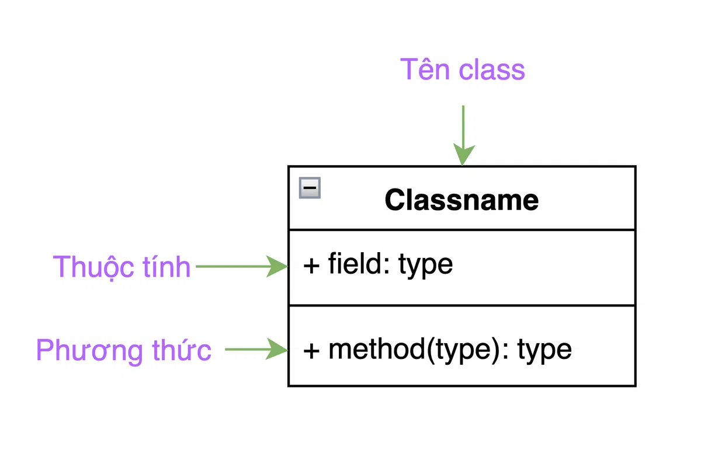
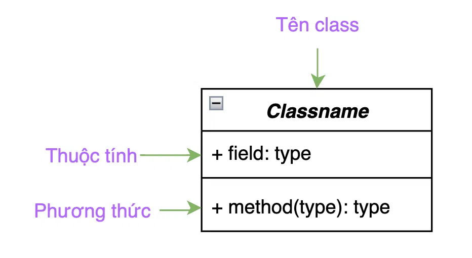
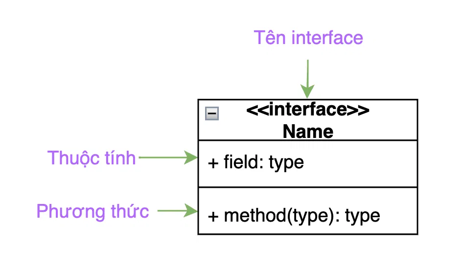

## Common UML Symbols

### Class

**Abstract Class:** The class name is italic

**Interface:** Has <<Interface>> added above the Name

### **Association**

- Symbol: A solid line connecting two classes, which may have an arrow on one or both ends depending on the direction of the relationship.
- Describes the relationship between two classes in which one class is associated with the other.
- If an arrow (greater-than or less-than) is present, it can be interpreted that the class at the arrow end is an attribute inside the class on the other end.

Example: Bill (Payment)

### Dependency

- Symbol: A dashed line connecting two classes and ending with an arrow.
- Describes a relationship in which one class depends on another class within a specific function or scope.
    - A class temporarily **uses** another class (method parameter, local variable).
    - Weak relationship – not ownership.
- Example: A method of `OrderService` receives `EmailService` as a parameter.

### Inheritance

- Symbol: A solid line connecting two classes and ending with a white triangle.
- Describes an inheritance relationship between two classes or between a class and an abstract class.
- The class at the white triangle is the parent class of the classes on the other end.

Example: Book is the parent class of AudioBook, EBook, PaperBack.

### Implementation

- Symbol: A dashed line ending with a white triangle.
- Describes an implementation relationship in which a class commits to implementing the definitions in an interface.
- The interface is at the white triangle end.

Example: EmailNotifier and SMSNotifier are classes that implement the Notifier interface.

### Aggregate

- Symbol: A solid line ending with an empty diamond.
- Describes a relationship in which one class requires information from another class, but both classes can still exist independently. The class at the diamond end is the class that needs the information.
- Example: RequestBook needs information from Book.

### Composition

- Symbol: A solid line ending with a filled black diamond.
- Describes a relationship in which one class owns another class; meaning it must aggregate information from the class it owns, and the contained class cannot exist without the owning class.
- Example: House owns Rooms; there can only be Rooms when a House exists.

## Behavior Patterns
* ### <a href="lproject.Mediator">Mediator pattern</a>

## Structural Patterns

## Creational Patterns

## Others